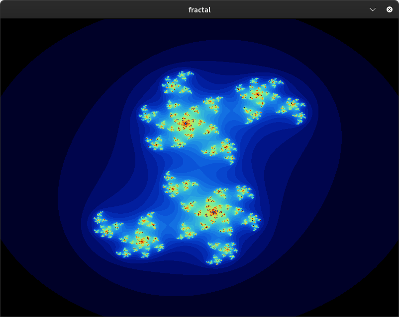
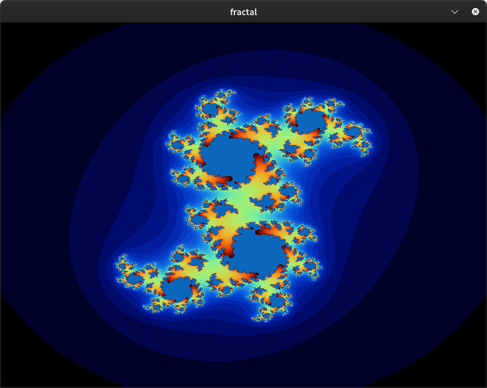
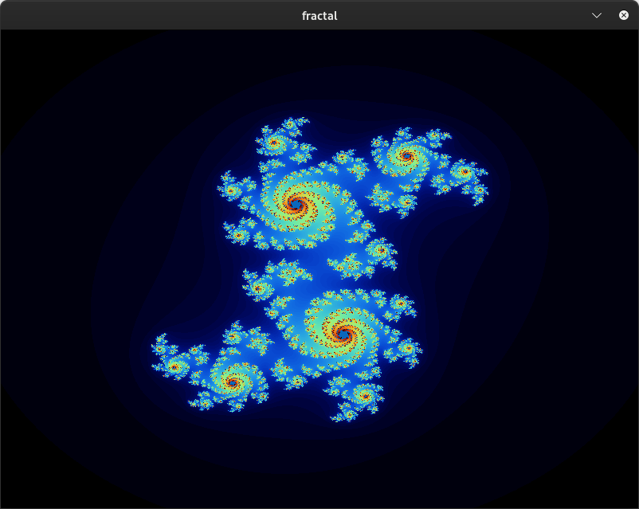
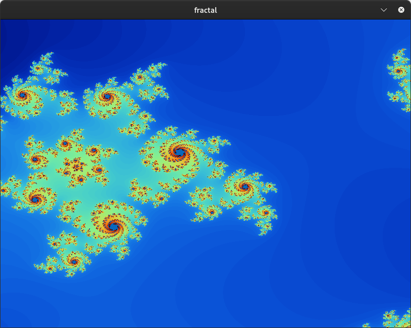
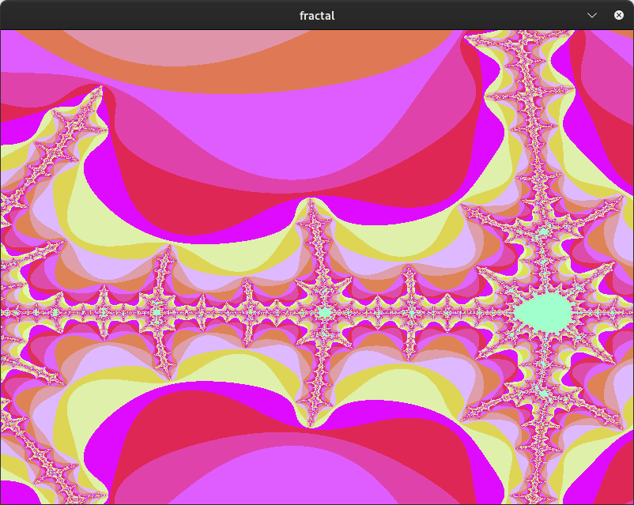

# Fractal Visualization Tool

## Description
This project is a fractal visualization tool implemented in C using the MiniLibX library. It allows you to explore the intricate patterns of famous fractals like the Mandelbrot and Julia sets. The program includes interactive features such as zooming, panning, and color customization to enhance the visual experience.

## Features
- **Mandelbrot Set**: Explore the famous Mandelbrot set with dynamic zooming and panning.
- **Julia Set**: Visualize the Julia set with different parameters and iterations.
- **Interactive Controls**: Customize the view with zoom, pan, and color options.

## Getting Started
To run this project, you'll need to clone the repository along with the MiniLibX library, and then compile the program.

### Prerequisites
- GCC compiler
- MiniLibX library (included in the LIBFT directory)

### Installation
1. Clone the repository:
    ```bash
    git clone https://github.com/your-username/fractol
    cd fractol
    ```
2. Clone the MiniLibX library into the fractal directory:
    ```bash
    git clone https://github.com/42Paris/minilibx-linux
    ```
3. Compile the project using the provided Makefile:
    ```bash
    make
    ```

## Screenshots
Below are some images showcasing different variations of the Julia set:

1. **Main Julia Set (c = 0.4 + 0.4i)**

   

2. **Julia Set with Variation of c**

   

3. **Julia Set with Increased Iterations**

   

4. **Zoomed-In Julia Set**

   

## Mandelbrot Set Example



## Usage
Once compiled, you can run the program with the following commands:

- To visualize the Mandelbrot set: `./fractol 1`
- To visualize the Julia set: `./fractol 2 0.4 0.4` (You can replace `0.4 0.4` with different parameters to explore other variations.)
