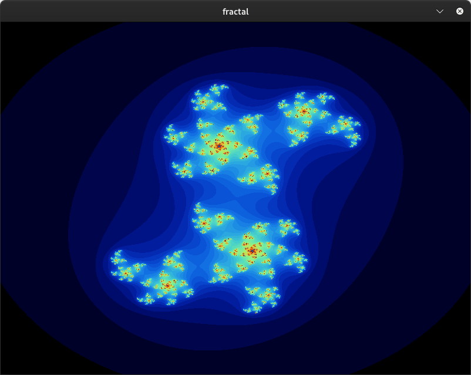
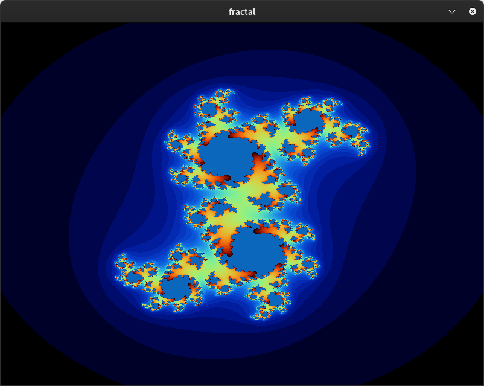
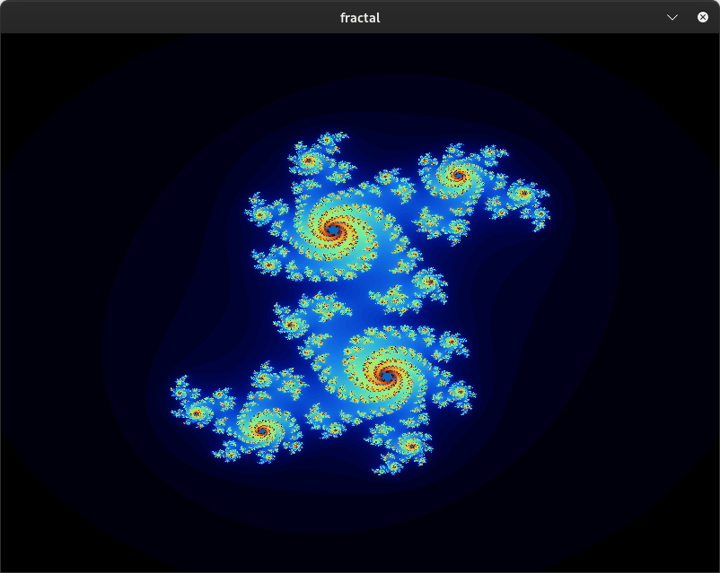
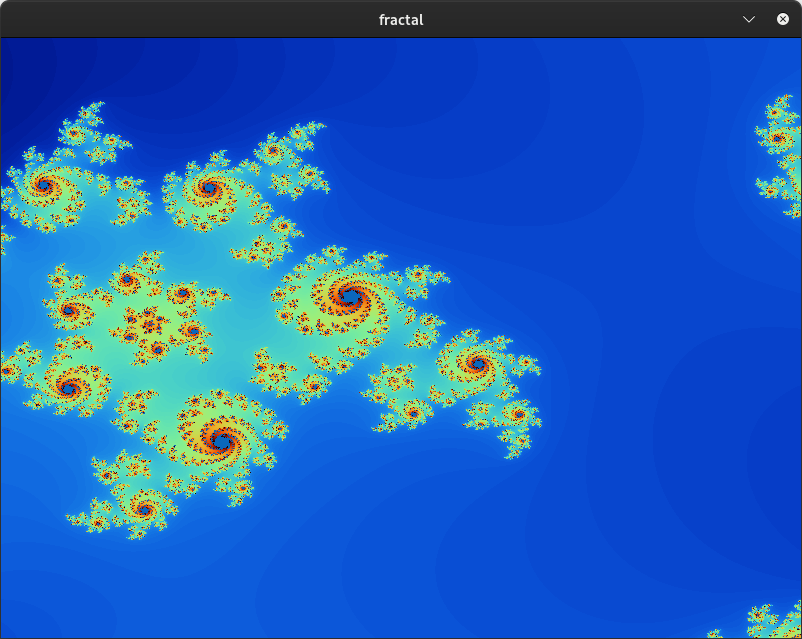
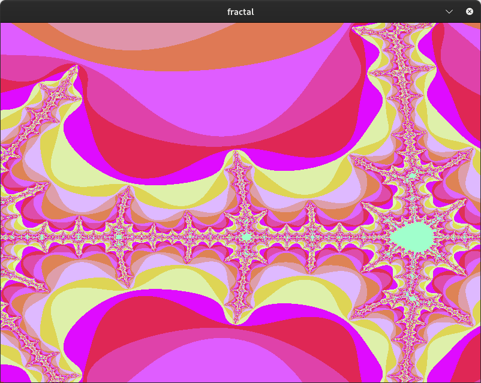

# Fractal

An interactive fractal explorer written in C that renders the Mandelbrot and Julia sets in a live window you can zoom, pan, and recolor in real time.

## Features

- Renders the Mandelbrot and Julia sets at up to 1000 iterations
- Zoom centered on the mouse cursor with the scroll wheel
- Click and drag to pan across the complex plane
- Adjust the Julia set constant interactively to morph its shape
- Increase or decrease iteration depth on the fly to reveal finer detail

## Getting Started

```bash
git clone https://github.com/tohmeh/Fractal
cd Fractal
git clone https://github.com/42Paris/minilibx-linux
make
```

Run the Mandelbrot set:
```bash
./fractol 1
```

Run the Julia set (replace the two numbers with any real and imaginary parts):
```bash
./fractol 2 0.4 0.4
```

## Project Structure

```
Fractal/
├── src/          # Renderer, fractal math, event handling, input parsing
├── LIBFT/        # Bundled C utility library (strings, memory, printf, gnl)
└── makefile
```

## Screenshots










